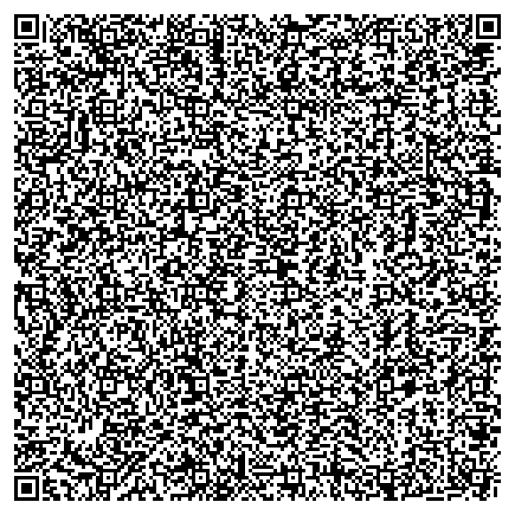

# Snake-Game-QR

A complete, playable HTML Snake game squeezed into a single QR code.

Scan the code below with your phone and the Snake game opens right in your browser — no install, no server, no network. The entire game (HTML + CSS + JavaScript) lives inside the QR code, encoded as a `text/html` data URL so a scanner treats it as a link and offers to open it.



## How it works

The game is written in a single, readable, commented [`input.html`](./input.html). Since a QR code can only hold a couple of kilobytes of data, competing minification algorithms shrink the game, and the best result is wrapped as a data URL before drawing it:

```
input.html ──(best algo + base64 data URL)──▶ qr-code.png ──(scan/decode)──▶ output.html
                      encode                                    decode
```

- **encode** ([`src/encode.ts`](./src/encode.ts)) — runs every algorithm in [`algos/`](./algos), takes the smallest output, wraps it in a `data:text/html;base64,…` URL, and renders that into `qr-code.png` with `qrcode`.
- **decode** ([`src/decode.ts`](./src/decode.ts)) — reads `qr-code.png` with `jimp`, extracts the data URL with `jsqr`, and unwraps it back to `output.html` (byte-identical to the winning output).

## The leaderboard

`algos/` is a competition: each file is a minification algorithm written by an AI model. An algorithm takes the text of `input.html` and returns a page that must look and behave identically — byte count is the score. [`algos/PROMPT.md`](./algos/PROMPT.md) is the challenge prompt: it is self-contained, so to get a new contender just hand a model that file plus `input.html`, and drop the returned module into `algos/`. The contract (plain-JS ES module, kebab-case filename, `meta` + `minify` exports) and the rules (derive the output from the input, deterministic, self-contained, ASCII, verified in a real browser) live in the prompt.

Current standings (`bun run compare`, [`src/compare.ts`](./src/compare.ts)):

| # | algo | model | html | data URL | QR code |
|---|------|-------|-----:|---------:|---------|
| 1 | [`integer-cell-golf`](./algos/integer-cell-golf.js) | Claude Fable 5 | 999 B | 1354 ch | v30 (137×137) |
| 2 | [`html-minifier-terser`](./algos/html-minifier-terser.js) | none (reference tool) | 1627 B | 2194 ch | v39 (173×173) |
|   | `input.html` (raw) | — | 6885 B | 9202 ch | does not fit |

Shared file paths and the data-URL helpers live in [`src/config.ts`](./src/config.ts); the algorithm loader in [`src/algos.ts`](./src/algos.ts).

> [!NOTE]
> Whether a scan opens the game depends on the browser. **iOS Safari** renders `data:text/html` URLs directly. **Chrome and Firefox** (desktop and Android) block top-level navigation to `data:` URLs as an anti-phishing measure, so they may show the URL as text instead of opening it. In those cases, save `output.html` and open it locally.

## Getting Started

### Requirements

- [Bun](https://bun.sh/ "Bun") — runs the TypeScript directly, no build step
- [git](https://git-scm.com/downloads "git") (only to clone this repository)

### Installation

```bash
git clone https://github.com/kaushalmeena/snake-game-qr.git
cd snake-game-qr
bun install
```

## Usage

Generate `qr-code.png` from `input.html`:

```bash
bun run encode
```

Recover `output.html` from `qr-code.png`:

```bash
bun run decode
```

Rank every algorithm in `algos/` by output size (HTML bytes, data-URL length, and the QR version each would need):

```bash
bun run compare
```

Type-check the sources:

```bash
bun run typecheck
```

To play, open `output.html` (or `input.html`) in a browser and steer with the **arrow keys**, or **swipe** on a touch screen. Eat the food to grow — the game speeds up as you do; running into yourself resets the run. The board wraps around all four edges. Your best length is kept on the scoreboard and saved to `localStorage` where the browser allows it (a page opened from the QR code has an opaque origin, so there the best lasts until the tab closes).

## License

This project is licensed under the MIT License - see the [LICENSE](LICENSE) file for details.
