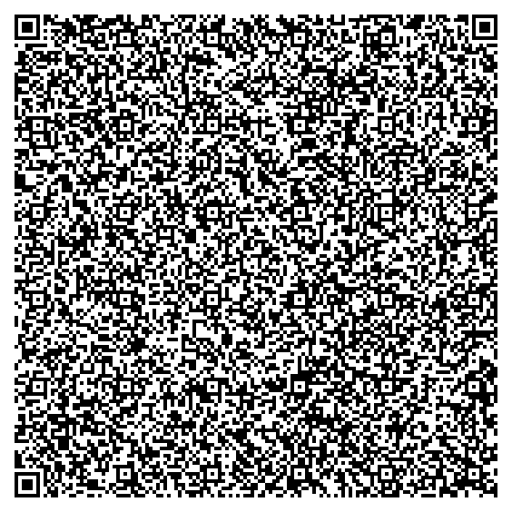

<div align="center">

# 🐍 Snake QR

**A complete, playable HTML Snake game squeezed into a single QR code** — with a leaderboard for the models that squeeze it smallest.



*📱 Scan it — the whole game unfolds right in your browser.*

</div>

Scan the code above with your phone and the Snake game opens right in your browser — no install, no server, no network. The entire game (HTML + CSS + JavaScript) lives inside the QR code, encoded as a `text/html` data URL so a scanner treats it as a link and offers to open it.

## How it works

The game is written in a single, readable, commented [`input.html`](./input/input.html). Since a QR code can only hold a couple of kilobytes of data, competing models hand-craft the smallest HTML page that plays the same game; the smallest submission is wrapped as a data URL and drawn as a QR:

```
output/<model>/output.html ──(smallest + base64 data URL)──▶ assets/qrcode.png ──(scan/decode)──▶ assets/output.html
                       encode                                                     decode
```

- **encode** ([`scripts/encode.js`](./scripts/encode.js)) — ranks the submissions in [`output/`](./output), takes the smallest `output.html`, wraps it in a `data:text/html;base64,…` URL, renders `assets/qrcode.png` with `qrcode`, and records the winner in `assets/winner.txt`.
- **decode** ([`scripts/decode.js`](./scripts/decode.js)) — reads `assets/qrcode.png` with `jimp`, extracts the data URL with `jsqr`, and writes `assets/output.html`, verifying it is byte-identical to the winning submission.

## The leaderboard

Each model's submission is a folder under [`output/`](./output) named for the model, holding a hand-golfed `output.html` (the scored page) and a `WRITEUP.md` (its approach). [`input/PROMPT.md`](./input/PROMPT.md) is the self-contained challenge prompt: hand it to a model along with `input.html`, and drop the two files it returns into `output/<model-name>/`. Every submission is held to behavioral equivalence by `npm test` ([`tests/snake.spec.js`](./tests/snake.spec.js)) — a Playwright suite that plays each `output.html` through the full checklist, plus a pixel-fidelity check against `input.html`, in a headless browser.

Current standings (`npm run compare` regenerates this table):

<!-- leaderboard:start -->

| # | model | html | gzip | vs baseline | QR code | output | writeup |
|---|-------|-----:|-----:|:-----------:|---------|:------:|:-------:|
| 1 | claude-fable-5 | 911 B | 671 B | −44% | v29 (133×133) | [output](./output/claude-fable-5/output.html) | [writeup](./output/claude-fable-5/WRITEUP.md) |
| 2 | gemini-3.5-flash | 1049 B | 689 B | −36% | v31 (141×141) | [output](./output/gemini-3.5-flash/output.html) | [writeup](./output/gemini-3.5-flash/WRITEUP.md) |
| 3 | gemini-1.5-pro | 1061 B | 723 B | −35% | v31 (141×141) | [output](./output/gemini-1.5-pro/output.html) | [writeup](./output/gemini-1.5-pro/WRITEUP.md) |
| 4 | claude-opus-4.8 | 1101 B | 698 B | −33% | v32 (145×145) | [output](./output/claude-opus-4.8/output.html) | [writeup](./output/claude-opus-4.8/WRITEUP.md) |
|  | html-minifier *(baseline tool)* | 1640 B | 965 B | — | v39 (173×173) | — | — |
|  | `input.html` (raw) | 8717 B | 2997 B | +432% | does not fit | — | — |

<!-- leaderboard:end -->

The runnable entrypoints (`encode`, `decode`, `compare`) live in [`scripts/`](./scripts); their shared helpers — paths and the data-URL codec ([`lib/config.js`](./lib/config.js)), the submission loader ([`lib/entries.js`](./lib/entries.js)), and ranking ([`lib/ranking.js`](./lib/ranking.js)) — live in [`lib/`](./lib).

> [!NOTE]
> Whether a scan opens the game depends on the browser. **iOS Safari** renders `data:text/html` URLs directly. **Chrome and Firefox** (desktop and Android) block top-level navigation to `data:` URLs as an anti-phishing measure, so they may show the URL as text instead of opening it. In those cases, save the decoded `output.html` and open it locally.

## Getting Started

### Requirements

- [Node.js](https://nodejs.org/ "Node.js") ≥ 20.11 — runs the JavaScript directly, no build step
- [git](https://git-scm.com/downloads "git") (only to clone this repository)

### Installation

```bash
git clone https://github.com/kaushalmeena/snake-qr.git
cd snake-qr
npm install
```

## Usage

Render the smallest submission into a QR code at `assets/qrcode.png` (and record the winner in `assets/winner.txt`):

```bash
npm run encode
```

Recover that page from the QR into `assets/output.html` (a round-trip check that it matches the submission):

```bash
npm run decode
```

Rank every submission in `output/` — HTML bytes, gzipped bytes, savings vs the baseline, and the QR version each would need. This regenerates the leaderboard table above (with links to each `output.html` and `WRITEUP.md`):

```bash
npm run compare
```

Run the behavioral test suite — a headless-browser ([Playwright](https://playwright.dev/)) harness that plays each submission's `output.html` and the baseline through the whole checklist (keyboard + swipe steering, swipe threshold, neck-reversal guard, wrap-around, eating, growth, self-collision, reset, score updates, best-score persistence, and graceful degradation when `localStorage` throws), a **frame-for-frame** canvas diff against `input.html` over a fixed run on a shared random stream (which also pins down the grow-from-one startup and the food RNG's draw order), and browser-free static checks (pure ASCII, self-contained, fits a QR):

```bash
npm test           # first run only: npx playwright install chromium
```

Each model (and the baseline) is its own Playwright project, so the run is grouped per model — and you can test a single one by its slug:

```bash
npx playwright test --project=gemini-3.5-flash
```

To play, open any model's `output.html` (or `input.html`) in a browser and steer with the **arrow keys**, or **swipe** on a touch screen. Eat the food to grow — the game speeds up as you do; running into yourself resets the run. The board wraps around all four edges. Your best length is kept on the scoreboard and saved to `localStorage` where the browser allows it (a page opened from the QR code has an opaque origin, so there the best lasts until the tab closes).

## License

This project is licensed under the MIT License - see the [LICENSE](LICENSE) file for details.
