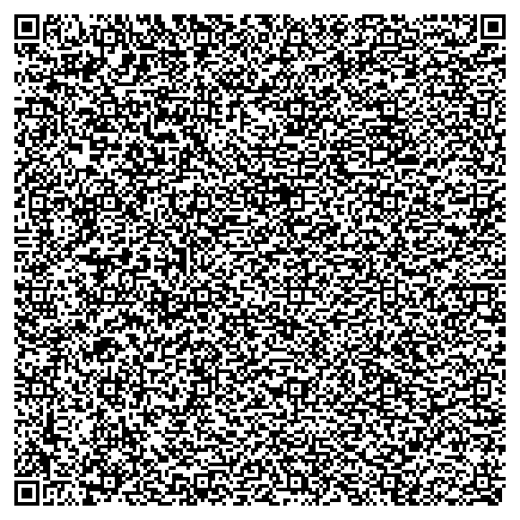

# Snake-Game-QR

A HTML snake game encoded in qr code.



## Requirements

To install and run this project you need:

- [NodeJS](https://nodejs.org/ "NodeJS")
- [git](https://git-scm.com/downloads "git") (only to clone this repository)

## Installation

To set up everything in your local machine, you need to follow these steps:

1. Clone this repo and then change directory to the `snake-game-qr` folder:

```bash
$ git clone https://github.com/kaushalmeena/snake-game-qr.git
$ cd snake-game-qr
```

2. Install project dependencies using npm:

```bash
$ npm install
```

## Usage

To create qr-code.png file from index.html run:

```bash
$ npm run encode
```

To create snake-game.html file from qr-code.png run:

```bash
$ npm run decode
```

## License

This project is licensed under the MIT License - see the [LICENSE](LICENSE) file for details
